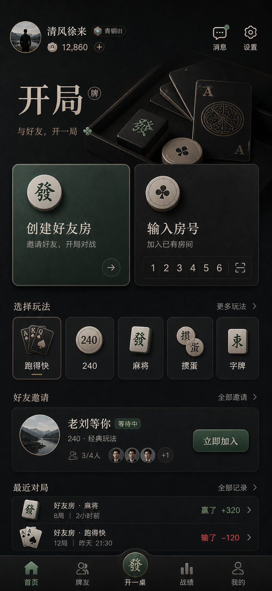

# UI 样式要求

更新时间：2026-06-23

## 1. 设计目标

UI 是项目最核心的竞争点。目标不是做一个普通棋牌大厅，而是做一个简约、高级、深色调、有记忆点的好友牌局小程序。

一句话方向：

> 深色高级的好友牌局工具，像高端牌具品牌和精致社交小程序的结合。

## 2. 用户明确偏好

- 偏微信小程序，而不是优先做 App
- 视觉要简约、高级
- 深色调更接近想要的方向
- 动画感不要太强
- 屏幕底部要有一排固定按钮
- 不满意普通棋牌大厅模板
- 不满意生活类产品 App 感
- 不满意缺少高级感的深绿、金边、3D 牌桌套路

## 3. 推荐视觉关键词

可以使用：

- 黑曜石
- 石墨黑
- 哑光黑
- 象牙白文字
- 低饱和玉绿色点缀
- 暗色牌具品牌
- 精致实体牌具
- 留白
- 克制
- 低对比层次
- 细腻材质
- 精准排版

## 4. 避免方向

明确排除：

- 国潮红金
- 年轻竞技手游风
- 卡通风
- 电竞风
- 赌场感
- 土味棋牌城
- 廉价深绿金边
- 过度 3D 牌桌
- 强发光按钮
- 强动画
- 满屏房间列表
- 生活方式 App 感
- 酒店会所感过重
- VIP / 会员有效期作为主要视觉表达

## 5. 页面结构要求

### 5.1 底部固定导航

屏幕最底部需要固定一排按钮。它是主要导航，不随内容滚动消失。

建议导航项：

- 首页
- 牌友
- 开一桌
- 战绩
- 我的

中间的「开一桌」可以作为视觉重点，但不要做夸张悬浮大按钮。

### 5.2 首页首屏

首页首屏必须优先表达：

- 当前用户积分
- 创建好友房
- 输入房号
- 常玩玩法
- 好友在线或好友邀请

不建议首屏堆太多房间列表。好友邀请可以保留一条最重要的邀请，例如：

- 老刘等你
- 240
- 3/4 人
- 等待中

### 5.3 操作优先级

主操作：

- 开一桌 / 创建好友房

次操作：

- 输入房号
- 邀请微信好友
- 选择玩法

辅助信息：

- 好友在线
- 积分
- 最近战绩

## 6. 视觉语言建议

### 6.1 色彩

建议：

- 背景：接近黑色的石墨黑，而不是纯黑
- 主文字：象牙白、暖白
- 辅助文字：低对比灰
- 点缀：低饱和玉绿
- 少量高光：暗铜或暖灰，但不要金光闪闪

### 6.2 材质

可以轻微使用：

- 哑光黑牌盒
- 黑色麻将牌
- 象牙牌面边缘
- 细微纸纹或皮革纹理

注意：材质只能作为气质点缀，不能堆成海报。

### 6.3 字体与排版

方向：

- 大标题克制但有气场
- 操作按钮文字清晰
- 正文保持 14-16px 可读
- 间距要大方
- 不使用过多描边、阴影、发光

### 6.4 图标与牌面

棋牌元素要精，不要满。

可以出现：

- 小型扑克牌符号
- 麻将牌局部
- 玩法 chip
- 牌具材质暗纹

避免：

- 大量扑克牌飞散
- 夸张金币
- 筹码堆
- 满屏麻将牌

## 7. 当前探索结论

前几轮探索中：

- 浅色生活类方向不满意，太像生活 App
- 常规棋牌大厅方向不满意，普通且缺乏新鲜感
- 深绿金边、3D 牌桌方向不满意，廉价感风险高
- 深色牌具品牌方向更接近，但需要从海报感收敛为可用产品

下一步建议：

> 用「暗色牌具品牌」的高级感，结合「深色日用小程序」的可用结构，继续打磨首屏方案。

## 8. 当前选定视觉目标

当前较接近的方向是「暗色牌具品牌」：

需要保留：

- 哑光黑和石墨黑基底
- 象牙白中文标题
- 低饱和玉绿色点缀
- 高端牌盒、麻将牌、扑克牌边缘等牌具品牌感
- 底部固定导航
- 中间「开一桌」作为主导航重点

继续优化时要注意：

- 顶部牌盒视觉可以再压暗，避免海报感过强
- 首页仍要优先服务创建好友房和输入房号
- 「创建好友房」和「输入房号」必须使用左右双入口排版，不使用上下堆叠
- 入口点击态使用细边框、微亮层和克制暗玉灰，不使用突兀的大面积深绿色
- 保持高级感，不回到普通棋牌大厅

## 9. HTML 原型

已新增可调样式的 HTML 原型：

- [prototype/index.html](../prototype/index.html)
- [prototype/visual-prototype.html](../prototype/visual-prototype.html)

当前原型用于快速调整：

- 深色牌具品牌视觉
- 左右双入口操作区
- 底部固定导航
- 克制点击态
- 玩法切换

当前阶段优先使用「图片热区原型」评审视觉，因为它和效果图一致，不会丢失材质、光影和字体气质。等视觉定稿后，再把设计拆成可维护的小程序组件。
